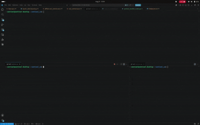

# Sentinel Project 
---
## RTOS using uT-Kernel 3.0 & AI-Friction Classification : Classify Surface and gain scheduling 

this repository for Sentinel project (enhanced for TIFA) using mT-Kernel 3.0 and TiniyML for AI-based ccontrolling system enhancement

### Demo

  
   
  <b>Left:</b> Robot Demo on Different Surface &nbsp;&nbsp; | &nbsp;&nbsp; <b>Right:</b> ROS Workspace and uT-Kernel Surface Classifier

### Pin Configuration

<table border="0">
  <th>
    Function
  </th>
  <th>
    Pin Config
  </th>
  <th>
    Port
  </th>
    <th>
    Function
  </th>
  <th>
    Pin Config
  </th>
  <th>
    Port
  </th>
  <tr>
    <td rowspan="2">VCP</td>
    <td>PA2</td>
    <td>RX</td>
    <td rowspan="2">Encoder Right</td>
    <td>PA7</td>
    <td>Ch1</td>
  </tr>
  <tr>
    <td>PA3</td>
    <td>TX</td>
    <td>PA6</td>
    <td>Ch2</td>
  </tr>
  <tr>
    <td rowspan="2">Serial Com</td>
    <td>PB15</td>
    <td>RX</td>
    <td rowspan="2">Encoder Right</td>
    <td>PA7</td>
    <td>Ch1</td>
  </tr>
  <tr>
    <td>PB14</td>
    <td>TX</td>
    <td>PA6</td>
    <td>Ch2</td>
  </tr>
  <tr>
    <td rowspan="3">Motor DC Right</td>
    <td>PC10</td>
    <td>Dir1</td>
    <td rowspan="2">Encoder Left</td>
    <td>PA0</td>
    <td>Ch1</td>
  </tr>
  <tr>
    <td>PC4</td>
    <td>Dir2</td>
    <td>PA1</td>
    <td>Ch2</td>
  </tr>
  <tr>
    <td>PB6</td>
    <td>Pwm</td>
    <td rowspan="2">PCA9548A/TCA9548A</td>
    <td>PB7</td>
    <td>SDA</td>
  </tr>
  <tr>
    <td rowspan="3">Motor DC Left</td>
    <td>PA5</td>
    <td>Dir1</td>
    <td>PB8</td>
    <td>SCL</td>
  </tr>
  <tr>
    <td>PC12</td>
    <td>Dir2</td>
    <td rowspan="2">MPU6050</td>
    <td>PCA_SD0</td>
    <td>SDA</td>
  </tr>
  <tr>
    <td>PB13</td>
    <td>Pwm</td>
    <td>PCA_SC0</td>
    <td>SCL</td>
  </tr>
  <tr>
    <td rowspan="2"><strong>INA219_1</strong></td>
    <td>PCA_SD1</td>
    <td>SDA</td>
    <td rowspan="2">INA219_2</td>
    <td>PCA_SD2</td>
    <td>SDA</td>
  </tr>
  <tr>
    <td>PCA_SC1</td>
    <td>SCL</td>
    <td>PCS_SC2</td>
    <td>SCL</td>
  </tr>
</table>

### External Power System for NUCLEO-H533RE

### System Architecture 
#### Diagram Block / Flow chart

### PID + FF
### Collect Data
### uT-Kernel 3.0
