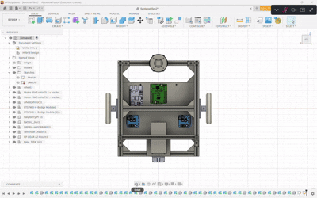
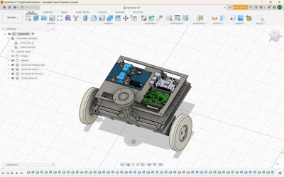

# SENTINEL: Adaptive Traction Control for Differential AMR using TinyML Surface Classification on μT-Kernel 3.0


<!-- @import "[TOC]" {cmd="toc" depthFrom=1 depthTo=6 orderedList=false} -->
<!-- code_chunk_output -->

- [SENTINEL: Adaptive Traction Control for Differential AMR using TinyML Surface Classification on μT-Kernel 3.0](#sentinel-adaptive-traction-control-for-differential-amr-using-tinyml-surface-classification-on-μt-kernel-30)
    - [Introduction](#introduction)
      - [Problem](#problem)
      - [System Overview](#system-overview)
    - [Demo](#demo)
    - [Robot Design / URDF](#robot-design--urdf)
    - [Hardware](#hardware)
      - [Electronics Design](#electronics-design)
      - [Required Components](#required-components)
      - [Pin Configuration](#pin-configuration)
    - [Firmware Architecture (uT-Kernel 3.0)](#firmware-architecture-ut-kernel-30)
      - [Task Structure & Priority](#task-structure--priority)
      - [PID + FeedForward](#pid--feedforward)
        - [Pid Model](#pid-model)
        - [Feedforward Control](#feedforward-control)
        - [Structure Execution](#structure-execution)
        - [Two way differences feedforward](#two-way-differences-feedforward)
      - [Uart Comm (Interrupt-driven)](#uart-comm-interrupt-driven)
        - [First Problem](#first-problem)
        - [Two UART lines](#two-uart-lines)
      - [Sentinel Task](#sentinel-task)
        - [two layer hysteresis](#two-layer-hysteresis)
        - [Gain Table](#gain-table)
          - [Output CLASSIFY](#output-classify)
  - [TinyML Pipeline](#tinyml-pipeline)
    - [Dataset Collection](#dataset-collection)
    - [Feature Engineering](#feature-engineering)
    - [Model Selection & Validation](#model-selection--validation)
    - [Gain Scheduling](#gain-scheduling)
  - [ROS2 Integration](#ros2-integration)
    - [diffdrive_arduino plugin](#diffdrive_arduino-plugin)
    - [sentinel_classifier_node](#sentinel_classifier_node)
    - [Topics](#topics)
  - [Results](#results)
    - [Classification Accuracy](#classification-accuracy)
    - [Timing (DWT)](#timing-dwt)
    - [Known Limitations](#known-limitations)
  - [Reproducing the ML Pipeline](#reproducing-the-ml-pipeline)
    - [License](#license)

<!-- /code_chunk_output -->
---

### Introduction
hallo, my name is rifqy fachrizi, called kiki. Sentinel-Project repository is my research project about RTOS and emebedded system, here i learned how to use RTOS on STM32, especially using uT-kernel 3.0 and combined with TinyML.
my research based on my experience, and i have many AMR project so why i dont use my platform for implementation this method? and i'll do it. on my AMR , i just enhanced the controller system using stm32-nucleo-h533re from arduino nano. and i'm using 

#### Problem 
AMR didnt know the surface character, like textured surface, normal or slippery. the matter of slippery surface for AMR is, sometime the wheel will slip, so from that problem this friction-classification is made.

#### System Overview


### Demo 
<table border="0" cellspacing="0" cellpadding="0">
  <tr>
    <td align="center"></td>
    <td align="center"></td>
  </tr>
  <tr>
    <td align="center">Robot Demo on Different Surface</td>
    <td align="center"> ROS Workspace and uT-Kernel Surface Classifier</td>
  </tr>
</table>

### Robot Design / URDF
<table border="0" cellspacing="0" cellpadding="0">
  <tr>
    <td align="center"></td>
    <td align="center"></td>
  </tr>
  <tr>
    <td align="center"><b>Normal Version 50x45x30 cm</b></td>
    <td align="center"><b>Mini Version 37x26x22 cm</b></td>
  </tr>
</table>

---

### Hardware
#### Electronics Design 


#### Required Components

|No | Component | Description | Manufacturer | Quantity
|---| --------  | ----------- | ------------ | ---------
|1  | STM32 Nucleo H533RE | TinyML integration with uT-kernel 3.0 | STMicroelectronics | 1
|2  | PCB Board   | shiled board for Nucleo H533RE |             | 1
|3  | MPU6050     | accel and gyro sensor for traction and surface Classification |             | 1
|4  | INA219      | current sensor for traction and surface Classification |              | 2
|5  | PG45 MotorDC with Encoder | Aktuator and Rotary Sensor | | 2
|6  | RPLidar A2M8/A1M12 | range laser sensor | Slamtec | 1
|7  | Robot Frame | frame robot structure |      | 1
|8  | BTS7960 | motor driver | | 2
|9  | Lippo Onbo 3S 11.1V | power supply | Onbo | 1

#### Pin Configuration

<table border="0">
  <th>
    Function
  </th>
  <th>
    Pin Config
  </th>
  <th>
    Port
  </th>
    <th>
    Function
  </th>
  <th>
    Pin Config
  </th>
  <th>
    Port
  </th>
  <tr>
    <td rowspan="2">VCP</td>
    <td>PA2</td>
    <td>RX</td>
    <td rowspan="4">Encoder Right</td>
    <td rowspan="2">PA7</td>
    <td rowspan="2">Ch1</td>
  </tr>
  <tr>
    <td>PA3</td>
    <td>TX</td>

  </tr>
  <tr>
    <td rowspan="2">Serial Com</td>
    <td>PB15</td>
    <td>RX</td>
    <td rowspan="2">PA6</td>
    <td rowspan="2">Ch2</td>
  </tr>
  <tr>
    <td>PB14</td>
    <td>TX</td>
  </tr>
  <tr>
    <td rowspan="3">Motor DC Right</td>
    <td>PC10</td>
    <td>Dir1</td>
    <td rowspan="2">Encoder Left</td>
    <td>PA0</td>
    <td>Ch1</td>
  </tr>
  <tr>
    <td>PC4</td>
    <td>Dir2</td>
    <td>PA1</td>
    <td>Ch2</td>
  </tr>
  <tr>
    <td>PB6</td>
    <td>Pwm</td>
    <td rowspan="2"><strong>PCA9548A/TCA9548A</strong>
    </td>
    <td>PB7</td>
    <td>SDA</td>
  </tr>
  <tr>
    <td rowspan="3"><strong>Motor DC Left</strong></td>
    <td>PA5</td>
    <td>Dir1</td>
    <td>PB8</td>
    <td>SCL</td>
  </tr>
  <tr>
    <td>PC12</td>
    <td>Dir2</td>
    <td rowspan="2"><strong>MPU6050</strong></td>
    <td>PCA_SD0</td>
    <td>SDA</td>
  </tr>
  <tr>
    <td>PB13</td>
    <td>Pwm</td>
    <td>PCA_SC0</td>
    <td>SCL</td>
  </tr>
  <tr>
    <td rowspan="2"><strong>INA219_1</strong></td>
    <td>PCA_SD1</td>
    <td>SDA</td>
    <td rowspan="2"><strong>INA219_2</strong></td>
    <td>PCA_SD2</td>
    <td>SDA</td>
  </tr>
  <tr>
    <td>PCA_SC1</td>
    <td>SCL</td>
    <td>PCS_SC2</td>
    <td>SCL</td>
  </tr>
</table>

---
### Firmware Architecture (uT-Kernel 3.0) 


#### Task Structure & Priority
|Task       | Function | Stack Size      |
|-----------|---------------------|-------|
|logTest (priority 5) |for logging data when datalog mode, activate with 'g' or 'h' commmand |  stack 1024 |
|pidTask (priority 10)| task for PID , using tk_dly_tsk(33) for getting 50ms efective, jitter measurement using DWT ±31 µs, and quantization using CNF_TIMER_PERIOD = 10ms | stack 1024 |
|sentinelTask (priority 11) | polling evry 50ms, gate: sentinelInferenceDue() every 10x push and efective ~0.5s/inference | stack 8192 |
|conTask (priority 12) | busy loop without delay, readcom() pop 1 byte every call and byte pump for IRQ ring buffer | stack 1024 |


#### PID + FeedForward
##### Pid Model
Controller using <b>velocity-form PID</b> not incremental form so not like PID as usually, output from each frame is equal with increment from current output with previous output : 
```python {cmd=true id="izdlk700"}
Kp = 70;
Ki = 0; #always
Kd = 110;
Ko = 50; #denumerator outpu
output = (Kp*Perror - Kd*(Input - PrevInput) + Iterm) / Ko;
output += pid->output;   #velocity form accumulation
```
- with ```Ki = 0``` permanent , ```Iterm``` never changed alone, system behave like <b>PD controller on velocity-form.</b>
- ```pid->output``` separate from feedforward ```u_ff``` , because ```pid->output``` is pure <b>PI-accumulator</b> so it wont double counted in each subsequent frame.

##### Feedforward Control
DC motor had a deadband and difference characteristic in each movement like forward or backward. and make the system delayed around 2s and have unstable tune.
Feedforward solved this problem :
```python {cmd=true id="izdlk700"}
uff = sign(target) x (u_db + k_v x |target| / KV_DEN);
```
konstanta like ```u_db``` and ```k_v``` measure based on the way robot move using sweep static open-loop (command```s```):
||u_db forward|k_v forward|u_db backward|k_v backward|
|-|-----------|-----------|-------------|-----------|
|Left Motor|157|178|142|190|
|Right Motor|146|155|100|201|

##### Structure Execution
every PID calculating and PWM writing its happen on ```doPID()```, not ```pidTask```:
```python {cmd=true id="izdlk700"}
EXPORT void doPID(SetpointInfo *pid){
  readEncoder(pid->enc);
  long u_ff = computeFeedForward(pid);
  output = (KP*Perror - Kd*(Pinput - PrevInput) + Iterm) / Ko;
  output += pid->output; #velocity form
  #clamp to headroom [-MAX_PWM - u_ff, MAX_PWM - u_ff]
  long pwm_final = u_ff + pid->output;
  setMotorSpeed(pid->motor, pwm_final);
}
```
```pidTask``` just call ```updatePID()``` that start doPID() for left and right motor.

##### Two way differences feedforward
```computeFeedForward()``` called 4x each frame:
- 2x inside ```doPID()``` for PWM calculating that has to be sent to motor.
- 2x more inside ```pidTask``` special for logging and ```sentinelPushFrame()```

The second calculate never send to motor. this separation is intentional. ```computeFeedForward()``` made as pure function so ```doPID()``` and telemetry using one true source without duplicate the formula.
The result : rise time down from 550ms to 350ms (-36%).


#### Uart Comm (Interrupt-driven)
##### First Problem
Previously ```readCom()``` using ```HAL_UART_Receive()``` polling. when ```ros2_control``` send the query and alternating motor commands, byte start skipping.
Root Cause : ```pidTask``` read INA219 and MPU6050 from I2C polling each frame and consume ~6ms with CPU on highest priority. during 6ms, ```comTask``` didn't get a turn. on 115200 baud, 6ms equal ~70byte.

Solution :
RX move to Interrupt-driven with ring buffer 64 byte:
```python {cmd=true id="izdlk700"}
void USART1_IRQHandler(void){ HAL_UART_IRQHandler(&huart1); }

void HAL_UART_RxCpltCallback(UART_HandleTypeDef *huart){
  if (huart->Instance == USART1) uartRxIsrPush();
}
```
```ISR``` didn't call any API kernel, just write to ring buffer volatile, so that not break the ```ISR μT-Kernel``` rule. NVIC get 5 on priority.
```readCom()``` doing pop non-blocking , 1 byte each calling:
```python {cmd=true id="izdlk700"}
if (s_rxTail == s_rxHead) return; #buffer empty , return
```
Because 1 byte each call, ```comTask``` running as busy-loop without ```tk_dly_tsk``` , this is the byte pump. because of that ```comTask``` never entry to wait state, the priority must be the lowest (12) so ```sentinelTask``` could be scheduled.
if ringg buffer full, ```ISR``` still re-arm ```HAL_UART_Receive_IT()``` but dropping the byte.

##### Two UART lines
|UART|Pin|Mode|Writer|
|----|---|----|------|
|USART1|PB14 TX/PB15 RX | RX Interrupt, TX Polling | ```comTask```|
|USART2|PA2 TX/PA3 RX| TX only (not using RX) |```sentinelTask```+```comTask```|

<b>Contention Point:</b>huart2 had 2 writer, ```sentinelTask```(push CLASSIFY) and ```comTask```(via ```vcpMonitor()```). ```HAL_BUSY``` is race but the consequence is still light, the highet risk is just 1 line log vanish. for control line (huart1) doesn't affected.

#### Sentinel Task
```sentinelTask``` doing polling every 50ms, but inference just running when the gate fullfilled:
```python {cmd=true id="izdlk700"}
while(1){
  if(sentinelInferenceDue()) sentinelRunInference();
  tk_dly_tsk(50);
}
```
```python {cmd=true id="izdlk700"}
return (s_count >= SENTINEL_WINDOW) && (s_pushCounter > 0u) && ((s_pushCounter % SENTINEL_INFER_EVERY) == 0u);
```
with ```SENTINEL_INFER_EVERY = 10``` and ```SENTINEL_WINDOW = 20```,inference efective running every ~0.5s. the mechanism is polling + gate counter, not task periodicly.

flow ```sentinelRunInference()```
|#|Stage|information|
|-|-----|-----------|
|1|```buildFeatureVector(input)```|read ring buffer with indexing modulo, nothing duplicate between 84 feature and 2.50ms|
|2|```sentinel_rf50x10(input,output)```|Random Forest Inference 0.54ms|
|3|```argmax``` 4 class -> ```best```|take class with the highest score|
|4|Shift Vote History|```s_voteHistory[0] = best```,```s_inferCount++```|
|5|Majority Counting|if equal, ```s_votedClass``` nothing change ,first layer hysteresis 
|6|Gain Hysteresis|if ```s_votedClass != s_currentGainClass``` during 5 inference in succession -> ```sentinelApplyGain()```|
|7|Push CLASSIFY|to huart2, each inference during ```s_votedClass >= 0```|
|8|Accumulation DWT Timing|timing instruments for feature and model|

##### two layer hysteresis
- <b>First Layer (Voting) :</b>
when no one single winner at 5 voting, value from previous class is maintained. prevent class blinking when ambiguous condition.
- <b>Second Layer (Gain Scheduling) :</b>
The gain is only changed after a different class appears 5 times in a row.Since inference takes ~0.5s,the gain changes at most ~2.5s after class a change. 
```python {cmd=true id="izdlk700"}
if (s_votedClass != s_currentGainClass){
  s_gainHysteresisCount++;
  if(s_gainHysteresisCount >=   SENTINEL_GAIN_HYSTERESIS_N){
    sentinelApplyGain(s_votedClass);
    s_currentGainClass = s_votedClass;
    s_gainHysteresisCount = 0;
  }
} else { s_gainHysteresisCount = 0; }
```
```sentinelApplyGain()``` just change <b>Kp and Kd</b>, ```Ki```,```Ko``` and ```Iterm``` untouched.

##### Gain Table
|Class|Kp|Kd|
|-----|--|--|
|NORMAL|70|110|
|TEXTURED|70|110|
|BANNER|70|110|
|LOADED|85|150|

###### Output CLASSIFY
```python {cmd=true id="izdlk700"}
CLASSIFY,3,LOADED,Kp=85,Kd=150
```
send to huart2 each inference. Node ROS2 ```sentinel_classifier_node``` read the stream from ```/dev/ttyACM0``` and publish to ```/sentinel/class``` and ```/sentinel/class_id```


---
## TinyML Pipeline
### Dataset Collection
- 4 permukaan, 120 run, pola manuver
- Kenapa maju-mundur
### Feature Engineering
- 84 fitur invarian
- Kenapa tegangan dibuang (kebocoran sesi)
### Model Selection & Validation
- GroupKFold per run — kenapa penting
- Perbandingan model
- Voting temporal
### Gain Scheduling
- Eksperimen per permukaan
- Kenapa hanya LOADED yang berbeda
- Hysteresis & bumpless transfer

---

## ROS2 Integration
### diffdrive_arduino plugin
### sentinel_classifier_node
### Topics

---

## Results
### Classification Accuracy
### Timing (DWT)
### Known Limitations

---

## Reproducing the ML Pipeline
[instruksi jalankan sentinel_ml_pipeline.py]

---
### License
> This project was submitted to TRON Programming Contest 2026.
> Original work by Rifqy Fachrizi, Diagonal Robotics.